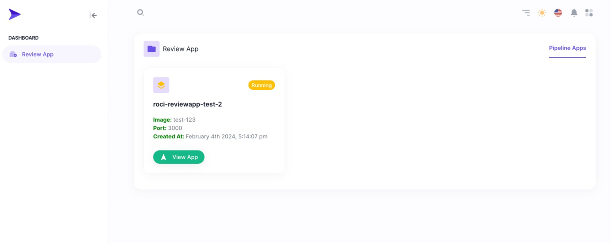

# Intro

Let's discover **Rocinante in less than 5 minutes**.

## What is the Rocinante?
If you are managing your applications in kubernetes environment, **Rocinante** is an infra tool that brings you an extra feature set to manage these applications. Currently there is only the **ReviewApp** feature, but over time this feature set will continue to expand (with yours support)

## Getting Started
- We said Rocinante is an application running in a kubernetes environment, so you must have a k8s cluster.
- Install **Rocinante**
```bash
kubectl apply -f https://raw.githubusercontent.com/rocinanteio/Rocinante/master/versions/rocinante-v1beta1.yaml
```
This command will install Rocinante your cluster. You can see this app below the **rocinante** namespace. It will follow up **roci** resources types. 

### Build Up Review App Client
You can create your review app resource with basic yaml config like below
```yaml
apiVersion: roci.io/v1beta1
kind: ReviewApp
metadata:
  name: reviewapp-sample
  namespace: roci-test
spec:
  version:
    ui: 0.0.4
    core: 0.0.4
  variables:
    coreApiPort: 30001
    coreApiSocketPort: 30002
    uiPort: 30003
    apiUrl: http://localhost:30001  
```

It will build up your *service* and *rocinante-ui*.

You can access them with nodeports;
````shell
<cluster-ip>:30001 (Core API)
<cluster-ip>:30002/reviewapps (Rocinante UI)
````

### Start your app with prepared image
````sh
http://<cluster-api>:30001/projects/start/image

Query Params
{
  "name": "test-app",
  "image": "idalavye/roci-reviewapp-1703706410364-test:master",
  "appPort": 3000
}
````
**name** is deployment and service objects names. <br/>
**image**  is your dockerized image. <br/>
**appPort** is exposed port number in your Dockerfile


Core API will be start a new deployment for serving to you. This EP will be return your environment information. Or you can see deployed app in Rocinante UI. 
<br/>




### Stop your app which is started with image
````sh
http://<cluster-api>:30001/projects/stop/image

Query Params
{
  "name": "test-app",
  "image": "idalavye/roci-reviewapp-1703706410364-test:master",
  "appPort": 3000
}
````

This EP will be stop your test environment. And also you can use Rocinante UI for stopping.

For full api documentation you can visit API swagger
````shell
http://<cluster-api>:30001/api
````
