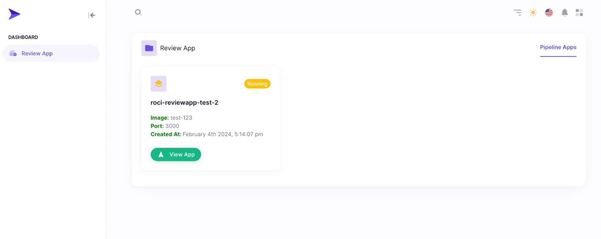

# Start App (via Image)

## Using Core API
You can start your project with prepared docker image. You can use Core API to start just below.

````sh
http://<cluster-api>:30001/projects/start/image

Query Params
{
  "name": "test-app",
  "image": "idalavye/roci-reviewapp-1703706410364-test:master",
  "appPort": 3000
}
````
**name** is deployment and service objects names. <br/>
**image**  is your dockerized image. <br/>
**appPort** is exposed port number in your Dockerfile


Core API will be start a new deployment for serving to you. This EP will be return your environment information. Or you can see deployed app in Rocinante UI.
<br/>



## Using With Pipeline 
You can integrate ReviewApp to your pipelines. We will provide an image `idalavye/pipeline` 

### With Dockerfile
```Dockerfile
FROM idalavye/pipeline

ENV api="http://localhost:3000"
ENV socket ="ws://localhost:4002"
ENV name="test-app"
ENV image="idalavye/roci-reviewapp-1703706410364-test:master"
ENV appPort=3000

CMD ["deno", "task", "start", "--api=$api --socket=$socket --name=$name --image=$image --appPort=$appPort"]
```

### With Gitlab
````yaml
review-app:
  image: idalavye/pipeline
  variables:
    API: http://localhost:3000
    SOCKET: ws://localhost:4002
    NAME: test-app
    IMAGE: idalavye/roci-reviewapp-1703706410364-test:master
    APP_PORT: 3000
  script: deno task start --api=$API --socket=$SOCKET --name=$NAME --image=$IMAGE --appPort=$APP_PORT
````
## Reference
| Name      | Type   | Description                                                | Sample                                            |
|-----------|--------|------------------------------------------------------------|---------------------------------------------------|
| `api`     | string | Rocinante Core API Url                                     | http://localhost:3000                             |
| `socket`  | string | Rocinante Core API WS Url (It will deployed automatically) | ws://localhost:4002                               |
| `name`    | string | Name of the Your ReviewApp                                 | test-app                                          |
| `image`   | string | Docker Image for your ReviewApp                            | idalavye/roci-reviewapp-1703706410364-test:master |
| `appPort` | number | Your exposed port in your Dockerfile                       | 3000                                              |
